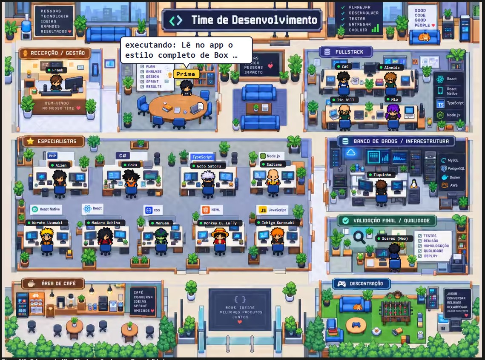
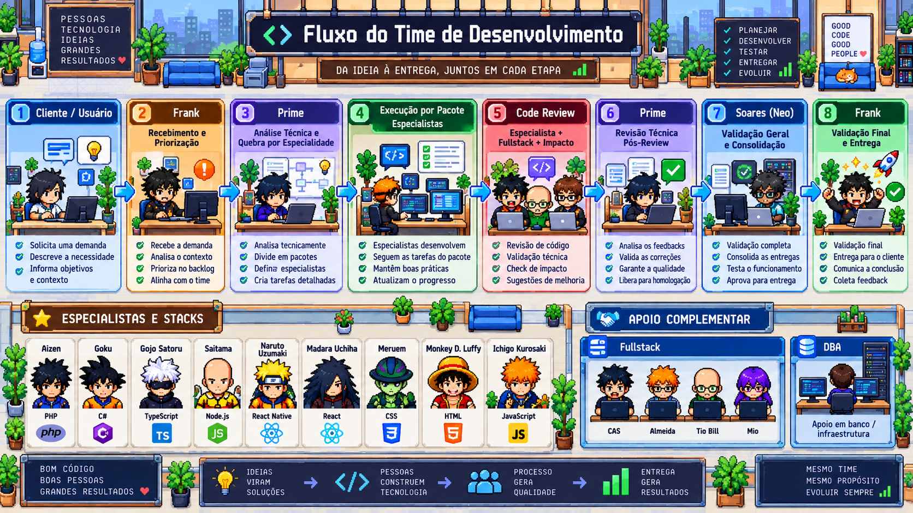

# Escritório do Time — mod para o Claude Code

Um painel dentro do Claude Code que mostra o escritório da equipe em pixel art e
anima, em tempo real, o caminho de cada demanda: o papel chega na recepção, quem
está com a demanda leva o papel andando até a mesa do próximo responsável, e o
agente que está trabalhando aparece em frente ao computador com um balão dizendo
o que está fazendo.



*O painel em funcionamento: o Prime com a demanda e o balão dizendo o que ele
está fazendo.*

## O que o painel mostra

- **Demanda chegando:** a cada novo pedido, um papel entra até o balcão da recepção.
- **Passagem de mão:** quem está com o papel levanta, anda pelos corredores até a
  mesa do próximo agente, entrega e volta para o próprio lugar.
- **Agente em atividade:** etiqueta amarela com o nome e balão de fala com a ação
  do momento (`editando Login.cs`, `executando: testes`, `lendo cenario.ts`).
- **Entrega:** ao fim do turno o papel volta à recepção, aparece um selo verde e
  o papel sai.
- **Legenda:** abaixo do desenho ficam a etapa do fluxo (1 a 8) e a atividade atual.
- **Vida no escritório:** quem não está com a demanda não fica parado na
  cadeira. Os agentes vão tomar café, conversam na mesa de um colega, jogam
  pebolim ou sentam no sofá da área de descontração e cochilam nos sofás.
  Quando a demanda chega para alguém que saiu, ele volta para a mesa.

O caminho da demanda não é simulado: o papel só anda a partir de eventos reais
da sessão. Os passeios de quem está sem demanda são decoração, sorteados pelo
mod, e nunca envolvem quem está com o papel.



## Requisitos

- Claude Code com suporte a mods (plugins de *function hooks*). É um recurso em
  acesso antecipado e a API pode mudar entre versões. Feito e testado na versão
  **2.1.288**.
- App desktop do Claude (aba Code) para ver o desenho. No terminal o painel
  mostra apenas um resumo em texto.

## Instalação

Clone o repositório:

```bash
git clone https://github.com/cas1260/claude-code-escritorio-time.git
```

Depois aponte o Claude Code para a pasta `escritorio-time`.

**Terminal, só nesta execução:**

```bash
claude --plugin-dir caminho/para/claude-code-escritorio-time/escritorio-time
```

**App desktop ou todas as sessões:** adicione a variável no bloco `env` do seu
`~/.claude/settings.json`, com o caminho absoluto da pasta:

```json
{
  "env": {
    "CLAUDE_CODE_PLUGIN_DIRS": "C:\\caminho\\para\\claude-code-escritorio-time\\escritorio-time"
  }
}
```

O painel abre no início da sessão. Para abrir de novo, digite `/escritorio`.

> A instalação por marketplace (`claude plugin install`) não é o caminho
> recomendado: na versão testada, o módulo de hooks de um plugin instalado só
> carrega se o recurso estiver liberado para a conta.

## O time vai junto

Não é preciso copiar nada para o seu `CLAUDE.md`. Enquanto o mod está
carregado, ele acrescenta às instruções de toda sessão a descrição do time: os
17 agentes e seus papéis, o fluxo de uma demanda e a forma de dizer quem está
atuando (`**Prime (Analista de Sistemas Sênior):** ...`). Com isso o Claude
trabalha como o time e o painel acompanha a demanda de mesa em mesa.

O texto completo, e como trocar ou desligar o time, está em [TIME.md](TIME.md).
Vale saber: essa descrição tem cerca de 2.900 caracteres (menos de mil tokens
em cada conversa) e muda o jeito de o Claude responder em todos os projetos em
que o mod estiver carregado.

## Como o mod sabe quem está com a demanda

| Evento da sessão | O que acontece no escritório |
| --- | --- |
| Começa um turno com texto | O papel chega à recepção (Frank). |
| A resposta traz uma linha que começa pelo nome de um agente, seguida de `:` ou travessão | Quem está com o papel leva até esse agente. Ex.: `**Prime (Analista):** quebrando em pacotes`. |
| Uma ferramenta edita ou escreve um arquivo e ninguém que implementa foi nomeado | O papel vai para o especialista da extensão do arquivo. |
| Qualquer chamada de ferramenta | O balão do agente em atividade mostra a ação. |
| O turno termina com resposta | O papel volta ao Frank, que entrega. |
| O turno é interrompido | Todos param; o papel fica onde está. |

Extensão → especialista: `php` Aizen · `cs`, `cshtml` Goku · `ts`, `mts`, `cts`
Gojo Satoru · `mjs`, `cjs` Saitama · `tsx`, `jsx` Madara · `css`, `scss`, `sass`,
`less` Meruem · `html`, `htm` Luffy · `js` Ichigo · `sql` Tiquinho.

Um bloco de texto que rotula mais de dois agentes é tratado como listagem (plano,
resumo) e não move o papel.

## Adaptando para a sua equipe

| Arquivo | O que tem |
| --- | --- |
| `escritorio-time/hooks/equipe.ts` | Os agentes: nome, papel, nomes aceitos no texto, extensões, posição da mesa. |
| `escritorio-time/hooks/time.ts` | A descrição do time que o mod acrescenta às instruções da sessão. |
| `escritorio-time/hooks/rotas.ts` | Os corredores por onde os personagens andam, a velocidade e os lugares de quem está sem demanda (café, sofás, pebolim). |
| `escritorio-time/hooks/diretor.ts` | As regras do fluxo (quem recebe, quando passa, quando entrega) e as rotinas de quem está sem demanda (o que fazem, por quanto tempo, quem é chamado de volta). |
| `escritorio-time/hooks/cenario.ts` | O desenho: fundo, personagens, passeios, balão, animações. |
| `escritorio-time/hooks/register.tsx` | Os hooks do Claude Code e o painel em camadas. |
| `escritorio-time/hooks/camada.tsx` | Uma camada sobre o fundo (mostra o desenho e pergunta ao mod se há um novo). |
| `escritorio-time/hooks/legenda.tsx` | A legenda abaixo do desenho. |
| `escritorio-time/arte/` | As imagens de origem: o escritório vazio e as folhas de sprites. |

Depois de trocar as imagens em `arte/`, refaça os arquivos de dados
(`dados-fundo.ts` e `dados-sprites.ts`):

```bash
python escritorio-time/ferramentas/gerar_dados.py --docs escritorio-time/arte
```

O gerador precisa de Python 3 com Pillow (com suporte a AVIF), numpy e scipy.
Cada folha de sprites tem 12 quadros por personagem em uma linha (3 de frente,
6 de lado, 3 de costas), com fundo transparente.

## Verificação

```bash
claude plugin validate escritorio-time
```

```bash
claude plugin test escritorio-time
```

## Como o painel é desenhado

O app recria um desenho inteiro sempre que ele muda, e isso faria a tela piscar.
Por isso o painel tem camadas sobrepostas:

- **Fundo:** a arte do escritório, desenhada uma vez e nunca mais refeita.
- **Agentes nas mesas:** os 17 agentes, o papel e quem o leva de uma mesa a
  outra. É refeita quando a demanda muda de mãos e quando começa um período
  de rotinas (a cadeira de quem sai fica vazia).
- **Passeios:** quem está sem demanda andando pelo escritório. É refeita
  quando um novo período de rotinas começa ou alguém é chamado de volta.
- **Balão:** o destaque de quem trabalha e o que ele está fazendo. É refeita
  quando o texto muda.
- **Legenda:** texto nativo, atualizado sem redesenhar o painel.

Cada uma das três camadas do meio é, na verdade, um par de camadas
transparentes que se revezam: o desenho novo entra em uma enquanto o antigo
continua visível na outra; só depois o antigo é limpo. E como cada par só é
refeito quando o conteúdo dele muda, trocar o texto do balão não mexe em quem
está andando.

As camadas perguntam ao mod, algumas vezes por segundo, se há algo novo para
mostrar.

## Limites conhecidos

- Cada camada precisa caber em 131.072 caracteres; por isso o fundo é uma versão
  comprimida da arte e os personagens têm cerca de 20 x 30 células.
- O texto do balão troca no máximo uma vez a cada 3 segundos, e nunca durante
  a caminhada de quem leva o papel.
- Em cada período de rotinas saem da cadeira no máximo 4 agentes, um depois do
  outro. Os personagens andam por cima da arte: ao passar por um móvel, quem
  anda aparece na frente dele.
- O desenho só existe no app desktop. No terminal e nas outras telas o painel
  mostra um resumo em texto.
- O tamanho do desenho acompanha a largura do painel. Para vê-lo maior, alargue
  o painel.

## Personagens

Parte dos personagens representa figuras de animes, que pertencem aos seus
respectivos donos. Este é um projeto de fã, sem fins comerciais e sem vínculo
com essas marcas. A licença abaixo cobre o código, não esses personagens.

## Licença

[MIT](LICENSE)
